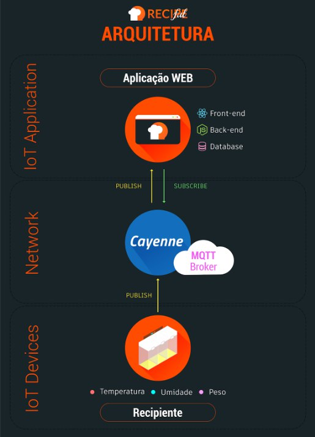

<h1 style="text-align: center;">Recipeful</h1>

 

    

 

Trabalho da cadeira Internet das Coisas na Universidade Federal do Ceará (UFC).

Equipe:

- Ícaro de Lima Rodrigues - 385194
- Thalisson Felipe de Sousa Feitosa - 390195

Professora: Dr. Atslands Rocha

## Descrição

Recipeful é uma aplicação que tem o objetivo de ajudar usuários a encontrarem receitas de forma mais prática e simples com os ingredientes que possuem em casa, evitando o desperdício de alimentos.

A ideia do projeto é prover uma aplicação web (e mobile, futuramente) gratuita onde o usuário possa cadastrar recipientes inteligentes que armazenam e monitoram os ingredientes em sua geladeira. Assim a aplicação retorna ao usuário todas as receitas que ele pode fazer baseada em suas preferências e ingredientes disponíveis. Assim o usuário economiza e consegue aproveitar ao  máximo os ingredientes que possui, além de aproveitar para experimentar receitas novas e diferentes.

A aplicação se comunica com o recipiente colhendo dados de temperatura, umidade e o peso de cada compartimento para garantir a proposta principal do Recipeful, que é evitar desperdícios. Cada recipiente inteligente tem pequenos compartimentos para os ingredientes, cada um destes será monitorado através do peso pela balança e a semântica (que ingrediente está sendo mantido ali) é definida pelo usuário da aplicação. Assim é possível saber quanto de cada ingrediente ainda tem disponível na geladeira e, consequentemente, quais receitas você pode fazer. O usuário pode monitorar isso estando em casa ou não, bastando logar na aplicação. A temperatura e a umidade fornecerão dados que permitem ao usuário garantir que os produtos não estraguem, por exemplo, carnes precisam estar em temperaturas mais frias (no congelador, por exemplo).

## Protocolos utilizados

- [MQTT](https://mqtt.org/)
- [HTTP](https://developer.mozilla.org/pt-BR/docs/Web/HTTP/Overview)

## Tecnologias utilizadas

- [Python](https://www.python.org/)
- [Nodejs](https://nodejs.org/en/)
- [Cayenne](https://developers.mydevices.com/cayenne/features/)
- [React](https://reactjs.org/)
- [MongoDB Atlas](https://www.mongodb.com/cloud/atlas)

## Arquitetura

A arquitetura é dividida em três camadas principais: a camada do dispositivo IoT, no nosso caso o recipiente inteligente (publisher MQTT); a camada de Rede ou nuvem, no nosso caso é onde se encontra o Cayenne (broker MQTT) que intermedia a comunicação entre as camadas; por fim, a camada da Aplicação IoT, no nosso caso o sistema WEB (subscriber MQTT) que mostra as receitas e monitora os recipientes.

    

## Instruções para rodar a aplicação

Para que a aplicação rode, é necessário ter os serviços backend e frontent rodando. Siga as instruções para instalar as dependências nos links abaixo:

- [Backend](backend/README.md)
- [Frontend](frontend/README.md)

Após instalar as dependências e deixar todos os serviços rodando, a aplicação estará rodando em `http://localhost:3000`.